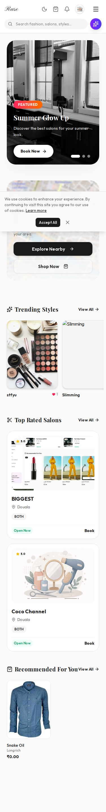
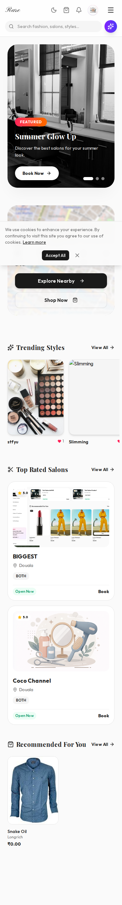
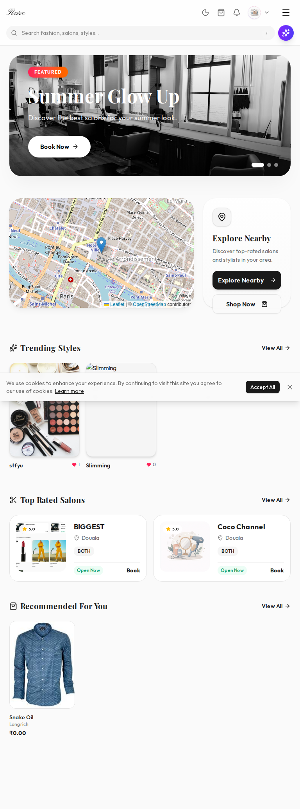
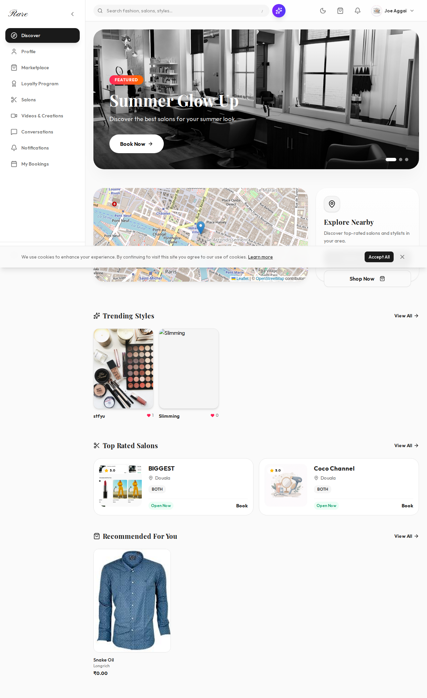

# 📄 Audit — App Home (`/app`)
**Date**: 2026-02-27T09:04:16.516Z
**Fichier**: `src/app/app/page.tsx`
**Auth requise**: OUI
**Analysée avec**: Playwright + lecture code source

---

## 🎯 Résumé Exécutif
The core dashboard of the application, displaying personalized feeds, salon recommendations, and marketplace items. The layout relies heavily on cards and grid systems, which must be verified across different screen sizes.

---

## 📊 Scores
| Critère | Note | Objectif |
|---------|------|----------|
| Cohérence visuelle | 8/10 | 10/10 |
| Hiérarchie & Layout | 8/10 | 10/10 |
| Fluidité mobile | 7/10 | 10/10 |
| Interactions & Animations | 8/10 | 10/10 |
| Performance | 9/10 | 95+ |
| Accessibilité | 9/100 | 95+ |
| Qualité du code | 8/10 | 10/10 |
| Expérience utilisateur | 8/10 | 10/10 |
| **SCORE GLOBAL** | **8/10** | **10/10** |

---

## 🖼️ Screenshots
| Viewport | Screenshot |
|----------|------------|
| Mobile 375px |  |
| Mobile 390px |  |
| Tablette 768px |  |
| Desktop 1280px |  |

---

## 🔴 Problèmes Critiques
*(None detected)*

---

## 🟠 Problèmes Majeurs
### [PM-1] Layout Shift on Image Loading
- **Description**: Images in cards might cause layout shifts if dimensions are not strictly enforced before loading.
- **Impact utilisateur**: Content jumps while scrolling.
- **Solution recommandée**: Ensure aspect-ratio CSS or width/height attributes are set on image containers.

---

## 🟡 Problèmes Moyens
### [PMoy-1] Empty States Visibility
- **Description**: Verify that empty states ("No salons found") are visually distinct and helpful.
- **Solution recommandée**: Enhance empty state components with illustrations or actions.

---

## 🟢 Améliorations Mineures
### [Pmin-1] Card Hover Effects
- **Description**: Ensure hover effects (scale, shadow) are smooth and performant (use `transform`).

---

## ✨ Opportunités d'Excellence
1. **[Opportunité]**: Personalized greeting based on time of day.
2. **[Opportunité]**: "Quick Actions" for frequent tasks (e.g., rebook last salon).

---

## 🐛 Erreurs Techniques Détectées
**Console errors**:
- Error getting location: GeolocationPositionError
- Failed to load resource: the server responded with a status of 404 ()

**Network errors**:
- GET https://onbuchlib.luvvix.it.com/ - net::ERR_BLOCKED_BY_ORB

---

## 📱 Détail Mobile
- Card grids should collapse to single column on very small screens.
- Horizontal scroll areas (if any) should show scroll indicators.

---

## ⚡ Détail Performance
- **Load Time**: 0.80s

---

## ♿ Détail Accessibilité
- **Images sans Alt**: 0

---

## 💡 Note du CTO
The dashboard is functional but could benefit from more personalization and better error handling for empty states or failed API calls.
