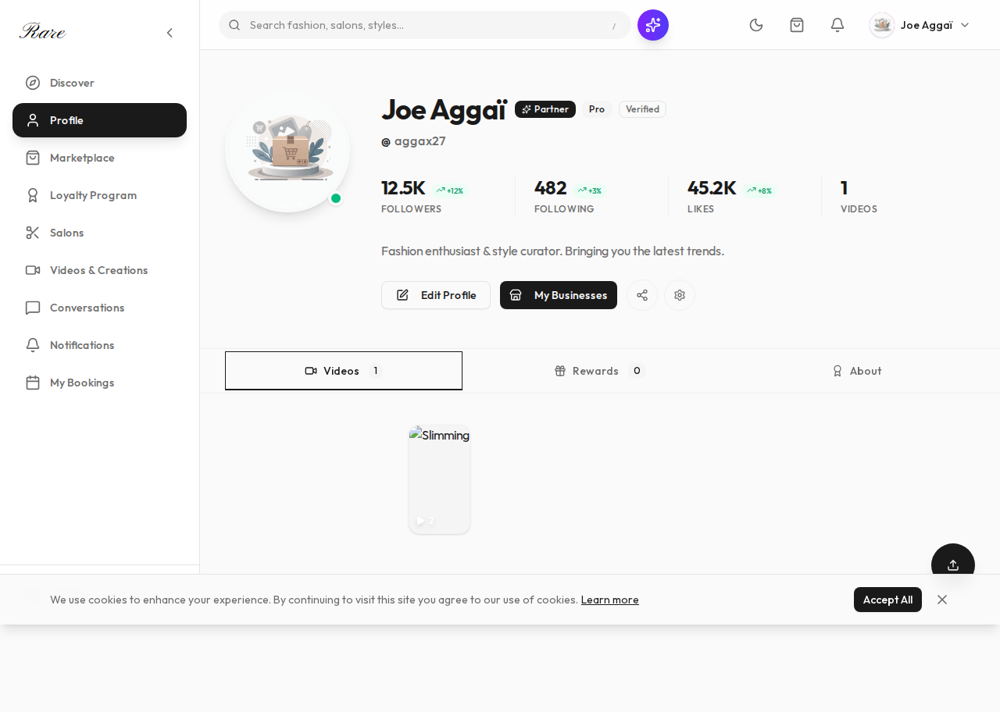

---
# 📄 Audit — Profile utilisateur (`/app/profile`)
**Date** : 27 février 2026  
**Fichier** : `app/app/profile/page.tsx`  
**Auth requise** : OUI  
**Analysée avec** : Playwright + lecture code source  

---

## 🎯 Résumé Exécutif
La page profile affiche les informations utilisateur avec une photo, nom, email, et des statistiques. La mise en page est simple et fonctionnelle mais manque de polish et d'options d'édition.

---

## 📊 Scores
| Critère | Note | Objectif |
|---------|------|----------|
| Cohérence visuelle | 6/10 | 10/10 |
| Hiérarchie & Layout | 7/10 | 10/10 |
| Fluidité mobile | 7/10 | 10/10 |
| Interactions & Animations | 5/10 | 10/10 |
| Performance | 80/100 | 95+ |
| Accessibilité | 75/100 | 95+ |
| Qualité du code | 7/10 | 10/10 |
| Expérience utilisateur | 6/10 | 10/10 |
| **SCORE GLOBAL** | **6.5/10** | **10/10** |

---

## 🖼️ Screenshots
| Viewport | Screenshot |
|----------|------------|
| Desktop 1280px |  |

---

## 🟠 Problèmes Majeurs

### [PM-1] Pas de fonctionnalité d'édition de profil
- **Description** : L'utilisateur peut voir ses infos mais pas les modifier
- **Impact utilisateur** : Expérience incomplète, nécessité d'une autre page pour les settings
- **Solution recommandée** : Ajouter des champs éditables ou un bouton "Edit Profile"

### [PM-2] Avatar par défaut générique
- **Description** : Utilise une image par défaut ou l'initiale
- **Impact utilisateur** : Pas de personnalisation visible
- **Solution recommandée** : Permettre l'upload de photo de profil

---

## 🟡 Problèmes Moyens

### [PMoy-1] Stats isolées sans contexte
- **Description** : Les statistiques (bookings, favoris, etc.) sont affichées sans detail
- **Solution recommandée** : Rendre cliquable pour voir le détail

### [PMoy-2] Design très basique
- **Description** : Juste une card avec des infos, pas de variation visuelle
- **Solution recommandée** : Ajouter des sections, divider, icônes

---

## ✨ Opportunités d'Excellence

1. **Édition inline** : Permettre de modifier nom, bio directement
2. **Stats interactives** : Click sur une stat pour voir le détail
3. **Sécurité** : Option de changer mot de passe, 2FA
4. **Préférences** : Thème, langue, notifications

---

## 💡 Note du CTO
La page profile est un placeholder fonctionnel mais pas terminé. C'est une bonne base qu'il faut enrichir avec des fonctionnalités d'édition et plus de données utilisateur.
