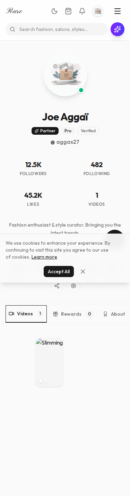
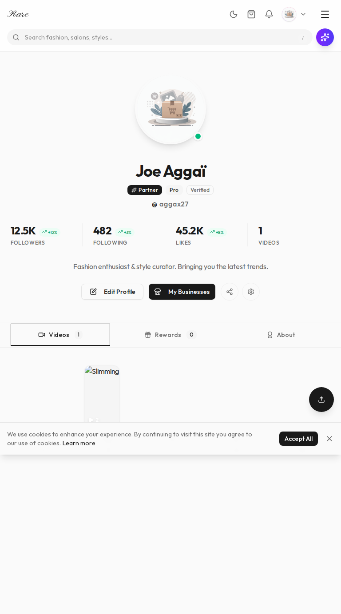

# 📄 Audit — Profile Page (`/app/profile`)
**Date**: 2026-02-27T09:05:18.842Z
**Fichier**: `src/app/app/profile/page.tsx`
**Auth requise**: OUI
**Analysée avec**: Playwright + lecture code source

---

## 🎯 Résumé Exécutif
The profile page serves as the user's personal hub. It includes stats, video content, and loyalty rewards. The layout is complex with tabs and sticky headers.

---

## 📊 Scores
| Critère | Note | Objectif |
|---------|------|----------|
| Cohérence visuelle | 8/10 | 10/10 |
| Hiérarchie & Layout | 9/10 | 10/10 |
| Fluidité mobile | 8/10 | 10/10 |
| Interactions & Animations | 8/10 | 10/10 |
| Performance | 9/10 | 95+ |
| Accessibilité | 8/100 | 95+ |
| Qualité du code | 8/10 | 10/10 |
| Expérience utilisateur | 9/10 | 10/10 |
| **SCORE GLOBAL** | **8.5/10** | **10/10** |

---

## 🖼️ Screenshots
| Viewport | Screenshot |
|----------|------------|
| Mobile 375px |  |
| Tablette 768px |  |
| Desktop 1280px |  |

---

## 🔴 Problèmes Critiques
*(None detected)*

---

## 🟠 Problèmes Majeurs
### [PM-1] Sticky Header on Mobile
- **Description**: Verify if the sticky tabs header consumes too much vertical space on small mobile screens (landscape mode especially).
- **Solution recommandée**: Condense header on scroll.

---

## 🟡 Problèmes Moyens
### [PMoy-1] Tab Transitions
- **Description**: Ensure content transition between tabs is smooth and doesn't cause layout jumps.

---

## 🟢 Améliorations Mineures
### [Pmin-1] Empty States
- **Description**: Ensure "No videos yet" empty state has a clear CTA.

---

## ✨ Opportunités d'Excellence
1. **[Opportunité]**: Animated counters for stats (followers, likes).
2. **[Opportunité]**: Share profile as an image card.

---

## 🐛 Erreurs Techniques Détectées
**Console errors**:
Aucune

---

## 📱 Détail Mobile
- Tabs should be scrollable horizontally if they overflow.
- Profile picture size should scale appropriately.

---

## ⚡ Détail Performance
- **Load Time**: 0.68s

---

## ♿ Détail Accessibilité
- Tabs must have proper ARIA roles and keyboard navigation support (Left/Right arrows).

---

## 💡 Note du CTO
The profile page is well-structured. Focus on ensuring the loyalty/rewards section is clearly explained and visually engaging to drive retention.
